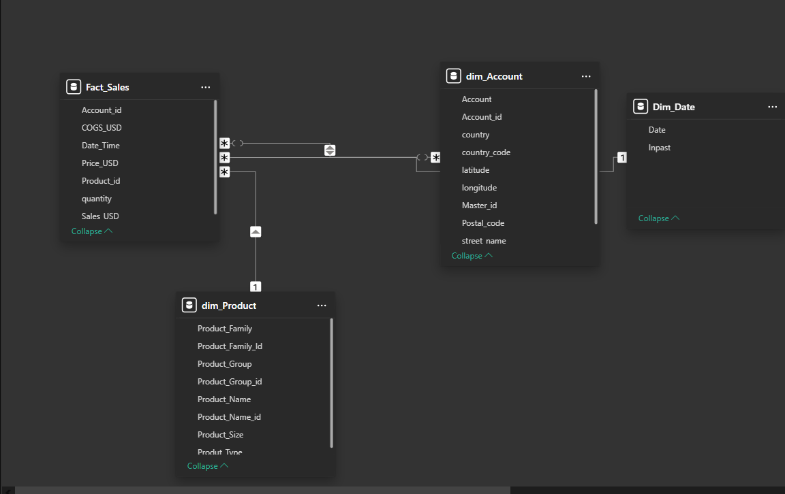

# Plant Co. Performance Dashboard

This Power BI dashboard provides an interactive and dynamic visualisation of Plant Co.'s performance for 2024/2023. It offers actionable insights into year-to-date (YTD) and prior year-to-date (PYTD) trends across countries, product types, and months, helping stakeholders quickly identify areas of improvement and growth.

See the full dashboard here!- [Power BI Link](https://app.powerbi.com/view?r=eyJrIjoiMDU3NWU4ZmEtZTdlZi00NGU2LThmNzAtMDhiZjUxZjdhZDkyIiwidCI6ImFlMzg1NGFjLWE2MDYtNDQ3OS1hZWQwLTg3YmExMTYwYTQzMyJ9)

# Key Features
Dynamic Filters and Interactivity: Enables users to filter data by year, gross profit, quantity, or sales for a tailored analysis.
Comprehensive Visuals:

Treemap: Highlights gross profit distribution by country, allowing for a clear comparison of performance.

Waterfall Chart: Illustrates YTD vs. PYTD gross profit changes by month, identifying increases and decreases.

Combo Chart: Displays gross profit trends and product value segmentation over time.

Scatter Chart with Zoom Slider: Explores account profitability segmentation, showing relationships between gross profit percentage (GP%) and value YTD.

# Data Sources
The dashboard was built using data from the Plant_DTS.xls dataset, which includes:

Geographical Data: Profit performance broken down by country.

Time-Series Data: Monthly gross profit, sales, and quantity metrics for 2024 and prior years.

Product Categories: Detailed segmentation into Indoor, Outdoor, and Landscape product types.

# The Journey: Building the Dashboard
This dashboard was developed with a focus on showcasing my technical expertise in Power BI and delivering actionable insights. Here’s the step-by-step process I followed:

# Data Preparation and Modeling:

Utilized virtual tables to clean and transform raw data into meaningful insights.
Built a robust data model to calculate key measures, including YTD, PYTD, GP%, and variances.
Measure Development:

Created custom DAX measures for gross profit analysis and other key performance indicators (KPIs).
Ensured the measures were dynamic and adaptable to filters applied by users.

Visualizations:

Designed intuitive and aesthetically pleasing visuals, ensuring they communicated insights clearly.
Incorporated advanced chart types such as Treemaps, Waterfall Charts, Combo Charts, and Scatter Plots.
Added a Zoom Slider for deeper exploration in scatter plots.
Dynamic Titles and Formatting:

Built dynamic titles that update based on user-selected filters, providing context to each visual.
Applied conditional formatting to emphasize key trends and outliers.
Tidying and Optimization:

Fine-tuned axis titles, labels, and colors for a polished, professional finish.
Ensured responsiveness and performance by optimizing DAX queries and limiting data loads.

# Data Model

The data model was designed to ensure optimal querying and reporting capabilities. It includes the following components:

Fact_Sales: The central fact table, containing measures like sales (USD), quantity, cost of goods sold (COGS), and gross profit.

Dim_Account: A dimension table with account-specific details such as account ID, country, postal code, and coordinates.

Dim_Product: Captures product information, including product family, group, name, size, and type.

Dim_Date: A date dimension table for temporal analysis, enabling time-based calculations like YTD and PYTD.

# Skills Demonstrated
Data Transformation and Modeling: Efficient use of Power BI’s modeling capabilities to create virtual tables and relationships.

DAX Expertise: Development of advanced measures to calculate KPIs and improve interactivity.

Visualization Techniques: Effective use of various Power BI visuals to present data clearly and interactively.

Attention to Detail: Focus on formatting, conditional formatting, and user-friendly design.

# Usage
This dashboard is ideal for:

Business Stakeholders: To gain insights into profitability trends and identify key opportunities.

Data Analysts: To explore profitability patterns and drive data-driven decisions.

